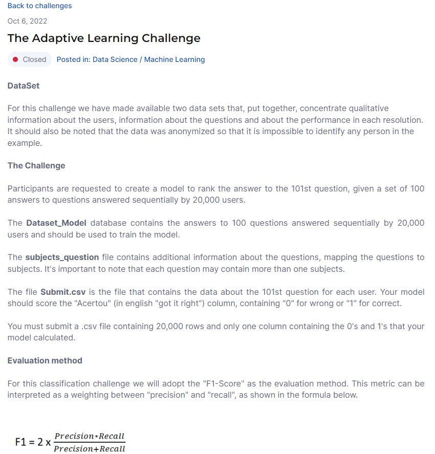
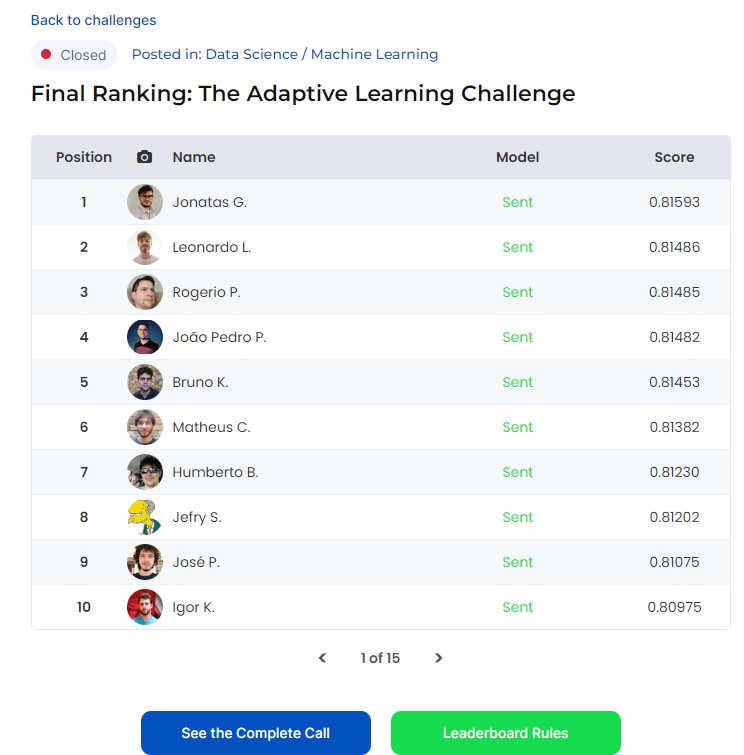
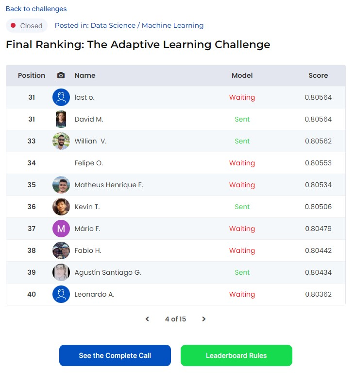

# O Desafio de Aprendizagem Adaptativa 
### (Desafio SigmaGeek - Qconcursos 06/10/22 - 15/11/22) 

Qual a probabilidade de um usuário acertar a próxima pergunta?

Contexto empresarial: 

<td>
O processo de aprovação em concursos públicos no Brasil exige cada vez mais uma preparação focada, equilibrada e direcionada. Nós, da Qconcursos, buscamos frequentemente evoluir nosso produto para facilitar esse processo de aprendizagem. Nesse sentido, buscamos contar com os melhores métodos educacionais e as melhores práticas tecnológicas.
</td>

<td>
Estamos convencidos de que o conceito de aprendizagem adaptativa se apresenta como uma possível solução para auxiliar os examinandos em sua metodologia de aprendizagem e, consequentemente, na busca pela carreira pública dos sonhos. Em geral, a ideia é adaptar o ensino e moldá-lo às necessidades e ritmo de aprendizagem de cada aluno dentro da nossa plataforma.
</td>

<td>
O objetivo desta competição é criar um modelo de aprendizado de máquina capaz de prever a probabilidade de um determinado aluno acertar a próxima questão, dada uma sequência anterior de cem resoluções.
</td>

https://sigmageek.com/challenge/the-adaptive-learning-challenge-1659401106436x437495826561630200

  

## Resultados
Após algumas soluções desenvolvidas e algoritmos testados (vide versões do projeto), a melhor performance foi obtida utilizando-se um modelo preditivo baseado no algoritmo 'Naive Bayes', alcançando um F1-Score de 0.80562 na solução enviada (a solução vencedora obteve 0.81593).

  

  

https://sigmageek.com/challenge_results/1659401106436x437495826561630200
